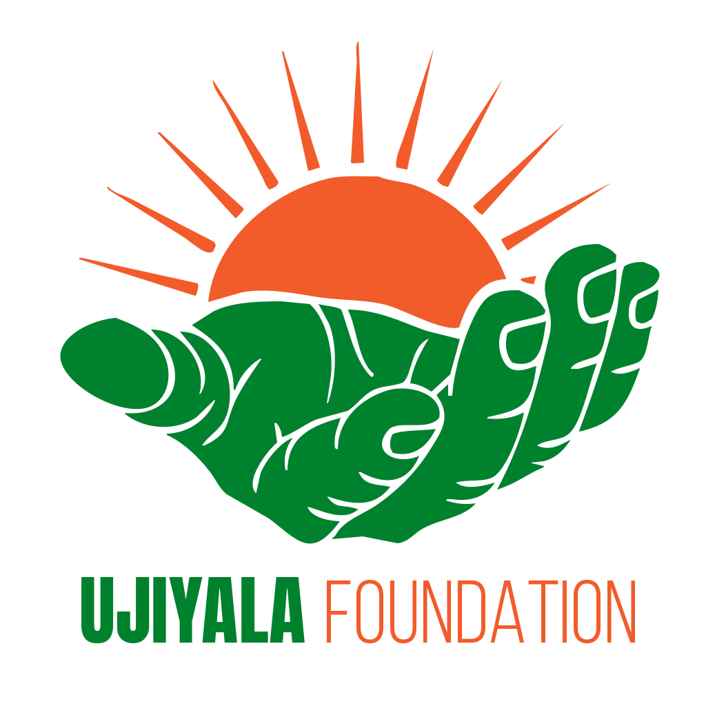

# Ujiyala Foundation — Showcase Edition



One-line pitch: a beautiful, role-driven, production-ready financial management web app built for small NGOs.

Badges
- Build: [](#)
- License: [](#)

Live demo
- If you host a demo, paste the demo URL here (e.g., https://demo.yoursite.org). Otherwise, follow the quick demo steps below to run locally.

Hero — what to show when presenting
- Dashboard: Remaining Balance, Totals, Quick Actions (mobile & desktop views)
- Pending Actions: how approvals flow between president/secretary/accountant
- Create Donation: show donation type and accountant verification → PDF receipt generation
- Create Member Request: memberType selection, auto-fee calculation, approvals → receipt PDF

Screenshots (replace with real images)
- Desktop dashboard: docs/screenshots/dashboard-desktop.png
- Mobile dashboard: docs/screenshots/dashboard-mobile.png
- Pending actions: docs/screenshots/pending.png
- PDF receipt sample: docs/screenshots/receipt.png

1) Start the backend (PowerShell)

Quick demo (what to run on your laptop)

2) Start the backend (PowerShell)

```powershell
cd server
cp .env.example .env
# edit .env: set MONGODB_URI, JWT_SECRET, ORIGIN, and optional CLOUDINARY_* values
npm install
npm run dev
```


Notes: If register-admin fails with 400, check server logs — the project uses Zod for validation and will print helpful details to the console.

3) Start frontend

```powershell
cd ../client
cp .env.example .env
npm install
npm run dev
```

How to present this project (3–5 minute walkthrough)
1. Start on the dashboard and point out the main KPIs: Remaining Balance, Total Donations, Membership Total.
2. Click Pending Actions — explain the approval flow and who sees what (role-based UX).
3. Open Create Donation, demonstrate choosing a Donation Type, submit, then switch to the accountant account to Verify and show the generated PDF receipt.
4. Open Member Request, demo memberType auto-fee behavior, then walkthrough approvals and the final receipt.

Talking points for stakeholders
- Security: JWT auth, server-side role enforcement, and Zod validation.
- Auditing: Approvals are preserved and included in the generated PDFs (receipts reference approvers).
- Extensibility: New categories, export formats, and integrations can be added without global refactors.

Optional extras to make the showcase shine
- Add real screenshots to `docs/screenshots/` and link them above.
- Add a short demo video (30–60s) and link it in the README or hero area.
- Add a simple seed script to create demo users and sample data automatically.

Technical quick reference (APIs)
- POST /api/auth/register-admin — create admin (protect in production)
- POST /api/auth/login — login and receive JWT
- GET /api/members — list members (role filtered)
- POST /api/members/requests — create membership request
- POST /api/members/requests/:id/approve — president/secretary approve
- POST /api/members/requests/:id/confirm-payment — accountant confirms and creates member
- GET /api/donations/pending — list pending donations (accountant)
- POST /api/donations/:id/verify — accountant verifies donation

Show checklist (pre-demo)
- [ ] Ensure backend is running and connected to MongoDB
- [ ] Create at least three demo users with roles: president, secretary, accountant
- [ ] Seed 4–6 sample donations and 2 member requests
- [ ] Confirm PDF generation works locally

License & credits
- This project is maintained for Ujiyala Foundation. Add a LICENSE file if you want to open-source or apply a specific license.

Contact
- Questions or collaboration: reach out to the maintainers listed in the repo.

---

© Ujiyala Foundation
